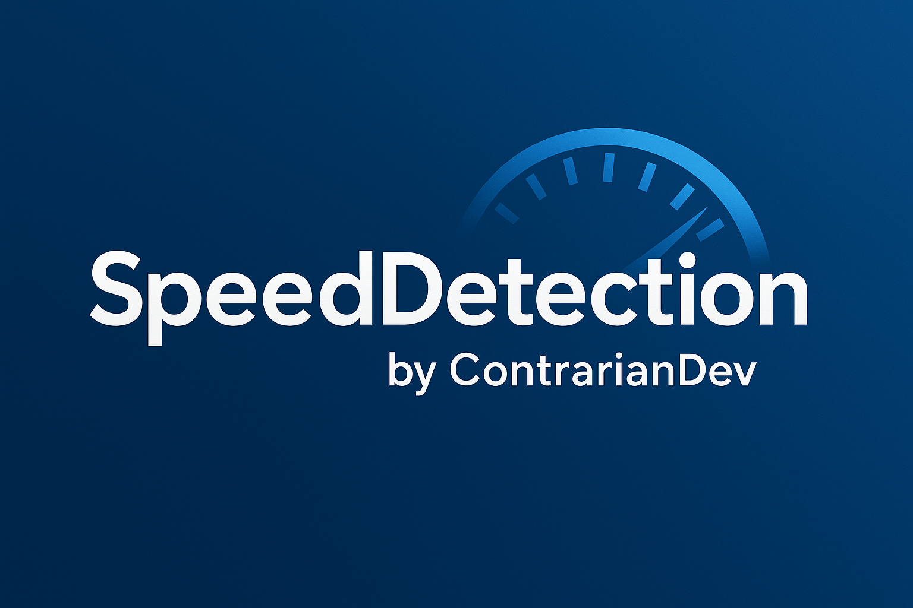
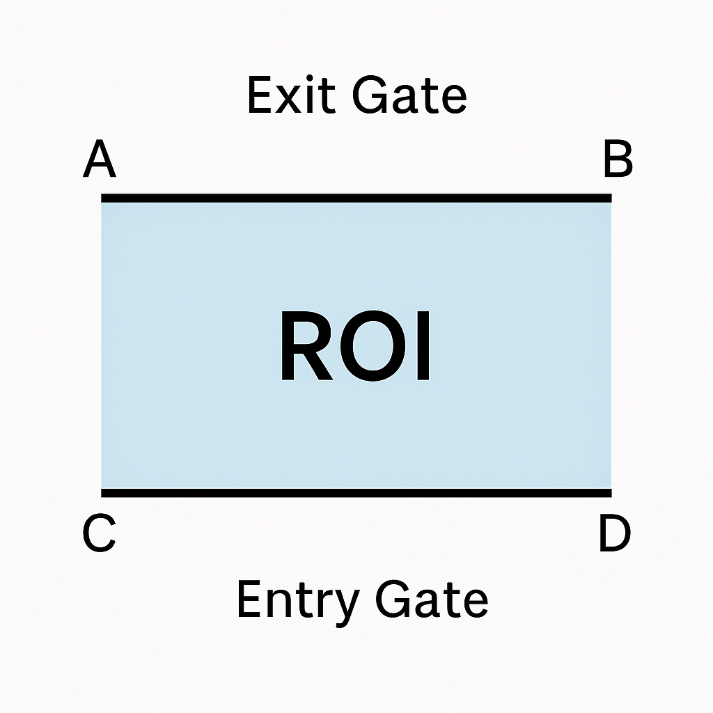

<div align="center">
  <h1>SpeedDetection.1.1</h1>
  <p><b>Real-Time Vehicle Speed Detection & Enforcement Camera</b></p>
  <p>Built with Roboflow Inference API, Supervision, ByteTrack, OpenCV, and Python</p>
  <!-- Optional project banner image -->
  
</div>

---


---

## 📚 Table of Contents

- [Overview](#-overview)
- [Key Features](#-key-features)
- [Project Structure](#-project-structure)
- [Getting Started](#-getting-started)
  - [Prerequisites](#prerequisites)
  - [Installation](#installation)
  - [Running the Script](#running-the-script)
- [Roboflow Inference API Setup](#-roboflow-inference-api-setup)
- [Supervision & ByteTrack](#-supervision--bytetrack)
- [How It Works](#-how-it-works)
- [Calibrating ROI with Google Maps](#-calibrating-roi-with-google-maps)
  - [1. Capture a Reference Frame](#1-capture-a-reference-frame)
  - [2. Measure Real-World Distance in Google Maps](#2-measure-real-world-distance-in-google-maps)
  - [3. Measure Pixel Distance in the Frame](#3-measure-pixel-distance-in-the-frame)
  - [4. Convert Pixels to Meters](#4-convert-pixels-to-meters)
  - [5. Derive Entry/Exit Line Distance](#5-derive-entryexit-line-distance)
- [Configuration](#-configuration)
- [Outputs](#-outputs)
- [Troubleshooting](#-troubleshooting)
- [Roadmap](#-roadmap)
- [Acknowledgements](#-acknowledgements)
- [License](#-license)

---

## 🔎 Overview

**SpeedDetection.1.1** is a real-time vehicle speed detection system designed for:

- Live traffic camera feeds (M3U8, RTSP, HTTP)
- Recorded video files (MP4, AVI, etc.)
- Situations where you want to monitor and log speeding vehicles

It uses:

- **Roboflow Inference API** for YOLOv8-based object detection (runs in the cloud)
- **Supervision** (including **ByteTrack**) for robust multi-object tracking
- **OpenCV** for video processing and visualization
- **Pygame** for optional audio alerts when a vehicle exceeds a speed threshold

The script calculates speed based on how long an object takes to move between two configurable on-screen “gate” lines defined by geo-marker points.

---

## ✨ Key Features

- ✅ Cloud-based YOLOv8 detection via **Roboflow Inference API** (no local GPU required)
- ✅ **ByteTrack** multi-object tracking for stable vehicle IDs across frames
- ✅ Speed estimation in **m/s** and **mph** using user-defined real-world distance
- ✅ **CSV logging** of all measured vehicles
- ✅ **Snapshot saving** of speeding vehicles
- ✅ **Processed video output** with overlays (bounding boxes + speed)
- ✅ Configurable detection confidence, IOU threshold, and speed limit
- ✅ Works with both live streams and offline video files

---

## 📁 Project Structure

```text
SpeedDetection.1.1/
│
├── src/
│   └── speed_detect.py          # Main speed detection script
│
├── output/
│   ├── speed_log5.csv           # Auto-generated CSV log
│   ├── videos/
│   │     └── output1.mp4        # Processed video with overlays
│   └── detections/
│         └── speed_*.jpg        # Snapshots of speeding vehicles
│
├── models/
│   └── yolov8n.pt               # (Optional) Local model storage if needed
│
├── docs/
│   ├── banner.png               # Project banner (optional)
│   └── roi-diagram.png          # ROI / gate diagram (optional)
│
├── requirements.txt
└── README.md
```

> 📝 Note: `output/` subfolders are auto-created on first run.  
> You can create `docs/banner.png` and `docs/roi-diagram.png` for GitHub visuals.

---

## 🚀 Getting Started

### Prerequisites

- Python **3.10+** (3.11 recommended)
- A **Roboflow account** and **API key**: <https://roboflow.com>
- Basic familiarity with command line / terminal

### Installation

1. **Clone the repository**:

   ```bash
   git clone https://github.com/your-username/SpeedDetection.1.1.git
   cd SpeedDetection.1.1
   ```

2. **Create a virtual environment**:

   **Windows (PowerShell):**

   ```powershell
   python -m venv venv
   venv\scripts\Aactivate
   ```

   **macOS / Linux:**

   ```bash
   python3 -m venv venv
   source venv/bin/activate
   ```

3. **Install dependencies**:

   ```bash
   pip install -r requirements.txt
   ```

### Running the Script

From the project root:

```bash
python src/speed_detect.py
```

The script will:

- Open the configured video stream or file
- Run detection + tracking
- Display a window named **"Speed Detection"**
- Save logs and outputs into the `output/` folder

Press **`q`** to quit the viewer.

---

## 🌐 Roboflow Inference API Setup

This project uses **Roboflow’s hosted inference** instead of running YOLO locally. This means:

- No local GPU required
- Model updates happen in Roboflow, not in the script
- Your local machine only needs to send frames and receive predictions

### 1. Create an Account and API Key

1. Go to <https://roboflow.com>
2. Create a free account (if you haven't already)
3. Navigate to **Settings → API Keys**
4. Copy your private API key

### 2. Configure the Model in `speed_detect.py`

In `src/speed_detect.py`, look for:

```python
from inference.models.utils import get_roboflow_model

model = get_roboflow_model(
    model_id="yolov8n-640",
    api_key="YOUR_API_KEY_HERE"
)
```

- Replace `YOUR_API_KEY_HERE` with your real API key.
- Optionally replace `model_id` with a **custom model** you’ve trained in Roboflow, such as:

  ```python
  model_id="my-dataset-name/3"
  ```

Check your model page in Roboflow for the exact `model_id` string.

### 3. Why an API Key is Needed

The API key:

- Authenticates you with Roboflow’s servers
- Links usage to your account
- Enables rate limiting and quota management

Keep your API key **secret** and avoid committing it directly in public repositories. Instead, consider using environment variables for production use.

---

## 🧠 Supervision & ByteTrack

This project uses **Supervision** for:

- Converting raw inference results from Roboflow into `Detections` objects
- Integrating **ByteTrack**, a high-performance multi-object tracker

ByteTrack ensures that each vehicle is assigned a **stable track ID** across frames, which is crucial for:

- Matching **entry** and **exit** times correctly
- Avoiding duplicate counting
- Handling short detection dropouts (e.g., under power lines or behind other vehicles)

Internally, the script does something like:

```python
detections = sv.Detections.from_inference(results)
tracked = byte_tracker.update_with_detections(detections)
```

Where `tracked.tracker_id` gives you a unique ID per vehicle.

---

## ⚙️ How It Works

At a high level:

1. **Capture video frame** from camera or file via OpenCV.
2. **Send frame to Roboflow Inference API** for YOLOv8 detections.
3. **Convert predictions** into `Detections` using Supervision.
4. **Run ByteTrack** to get stable `tracker_id` for each vehicle.
5. **Compute centroid** of each tracked bounding box.
6. **Detect when centroid crosses entry/exit lines** defined by `geo_markers`.
7. **Measure time difference** between entry and exit.
8. **Compute speed** based on known real-world distance between those two lines.
9. **Log results** to CSV and **save snapshots** for vehicles over the speed limit.

### Simple Gate Diagram

```text
A -------- B      <-- Exit line (top gate)
|        |
|  ROI   |
|        |
C -------- D      <-- Entry line (bottom gate)
```

- Vehicles cross **C–D** first → entry time stored.
- When they later cross **A–B** → exit time stored.
- Speed = (distance between gate lines in meters) / (time between crossings).

You configure the **real-world distance** via:

```python
real_distance_meters = 18.18
```

This should be calibrated based on your **actual camera scene**, which we cover next.



---

## 🗺️ Calibrating ROI with Google Maps

For accurate speed readings, you need a good estimate of the **real-world distance** between your entry and exit lines (C–D and A–B). One practical way to do this is to:

- Use a **sample frame** from your camera, and
- Use **Google Maps** (or Google Earth) to measure the real-world distance of the same road segment.

Below is a step-by-step guide.

### 1. Capture a Reference Frame

Use one of these methods:

- Let the script run, then press a key and modify code to save a frame via:

  ```python
  cv2.imwrite("reference_frame.jpg", frame)
  ```

- OR, use your OS’s screenshot tool to capture the video window.
- Save this as e.g. `docs/reference_frame.jpg` (optional but handy).

This frame will be your visual reference for marking geo points.

### 2. Measure Real-World Distance in Google Maps

1. Open **Google Maps** in a browser.
2. Navigate to the location of your camera.
3. Right-click on the road where vehicles pass and select **"Measure distance"**.
4. Click two points that correspond to recognizable features in your frame, e.g.:
   - Two lane markings
   - A crosswalk edge
   - Start and end of a turn/curve
5. Note the shown distance → this is your **real-world distance** in meters, call it `D_real`.

For example:

- Google Maps shows: **59 ft** → convert to meters:
  - 59 ft × 0.3048 ≈ **17.98 m**

### 3. Measure Pixel Distance in the Frame

Now, measure the same two points in your captured frame (the same physical locations).

There are multiple ways to do this:

#### Option A: Use an Image Editor

1. Open `reference_frame.jpg` in an image editor that shows pixel coordinates (e.g. GIMP, Photoshop, many others).
2. Hover over point 1 → note `(x1, y1)`.
3. Hover over point 2 → note `(x2, y2)`.
4. Compute pixel distance:

   ```text
   D_px = sqrt((x2 - x1)^2 + (y2 - y1)^2)
   ```

#### Option B: Use a Small Python Script

You can also write a quick helper script:

```python
import cv2
import math

img = cv2.imread("reference_frame.jpg")

points = []

def click_event(event, x, y, flags, param):
    if event == cv2.EVENT_LBUTTONDOWN:
        points.append((x, y))
        print(f"Point {len(points)}: ({x}, {y})")
        if len(points) == 2:
            (x1, y1), (x2, y2) = points
            d_px = math.dist((x1, y1), (x2, y2))
            print(f"Pixel distance: {d_px:.2f} px")

cv2.imshow("ref", img)
cv2.setMouseCallback("ref", click_event)
cv2.waitKey(0)
cv2.destroyAllWindows()
```

Click two points in the image and it will print the pixel distance.

### 4. Convert Pixels to Meters

Once you have:

- Real-world distance `D_real` (meters)
- Pixel distance `D_px` (pixels)

You can compute **meters per pixel**:

```text
meters_per_pixel = D_real / D_px
```

For example:

- `D_real = 18.0 m`
- `D_px = 250 px`

Then:

```text
meters_per_pixel = 18.0 / 250 = 0.072 m/px
```

### 5. Derive Entry/Exit Line Distance

Now choose the **y-coordinates** (and x extents) for your C–D and A–B lines in the frame. For example:

```python
geo_markers = {
    "A": (160, 174),  # Exit line
    "B": (365, 200),
    "C": (3,   280),  # Entry line
    "D": (168, 355)
}
```

If the road is mostly vertical in the image (vehicles moving roughly up/down), you can approximate the vertical distance between lines using their **average y-coordinates**:

```python
import math

y_top = (geo_markers["A"][1] + geo_markers["B"][1]) / 2.0
y_bottom = (geo_markers["C"][1] + geo_markers["D"][1]) / 2.0

pixel_distance_between_gates = abs(y_bottom - y_top)
real_distance_meters = pixel_distance_between_gates * meters_per_pixel
```

Use this `real_distance_meters` in your script:

```python
real_distance_meters = real_distance_meters  # from your calculation
```

> 🔍 Note: If the road is angled or perspective distortion is strong, a simple linear scale will be less accurate. For advanced setups, you can use **planar homography** and full camera calibration, but for many traffic cams, this approximate method works well enough for relative speed enforcement.

---

## 🔧 Configuration

Within `speed_detect.py`, you can tune several parameters:

### Detection Confidence

```python
confidence = 0.5  # lower to detect more, higher to be stricter
```

### IOU Threshold

```python
iou_threshold = 0.7
```

### Speed Limit (mph) for Alerts

```python
if speed_mph > 35:
    # trigger snapshot + sound
```

### Vehicle Classes

If you want to restrict detections to certain COCO classes:

```python
VEHICLE_CLASS_IDS = [2, 3, 5, 7]  # car, motorcycle, bus, truck
```

---

## 📤 Outputs

- **CSV Log** → `output/speed_log5.csv`  
  Contains:
  - `Object ID`
  - Entry time (EST)
  - Exit time (EST)
  - Time taken (s)
  - Speed (m/s)
  - Speed (mph)

- **Processed Video** → `output/videos/output1.mp4`  
  Includes bounding boxes, IDs, and speed overlays.

- **Speeding Snapshots** → `output/detections/speed_*.jpg`  
  Saved whenever a vehicle exceeds the configured speed threshold.

---

## 🛠️ Troubleshooting

### No Window Appears / Video Not Playing

- Check your stream URL or file path.
- Make sure `cap.isOpened()` is returning `True`.
- Try a local video file first to confirm pipeline works.

### All Speeds are 0 or Nonsense

- Double-check `real_distance_meters` calibration.
- Ensure vehicles actually cross both entry and exit lines.
- Verify your FPS estimate; some network streams may report 0 FPS.

### API Key / Authentication Errors

- Make sure your API key is valid and not expired.
- Avoid committing the key to public repositories.
- Check Roboflow’s usage/dashboard for more details.

### High CPU Usage

- Increase `process_every_nth_frame` to skip frames.
- Lower your input resolution or use a lower-res stream.

---

## 🧭 Roadmap

- [ ] CLI arguments for stream URL and config
- [ ] YAML/JSON config for ROI & camera calibration
- [ ] Optional local YOLOv8 fallback (no API)
- [ ] Web dashboard for live monitoring
- [ ] Multi-camera support

---

## 🙏 Acknowledgements

This project is built on top of amazing open-source and hosted tools:

- **Roboflow Inference API** – Cloud-hosted YOLO models  
  <https://roboflow.com>

- **Supervision** – Utilities and ByteTrack integration  
  <https://supervision.roboflow.com>

- **ByteTrack** – Multi-object tracking algorithm  
  <https://github.com/ifzhang/ByteTrack>

- **OpenCV** – Computer vision and video processing  
  <https://opencv.org/>

Special thanks to the open-source community for enabling real-time vision applications like this one.

---

## 📄 License

This project is licensed under the **MIT License**.  
You are free to use, modify, and distribute it, subject to the terms of the license.
